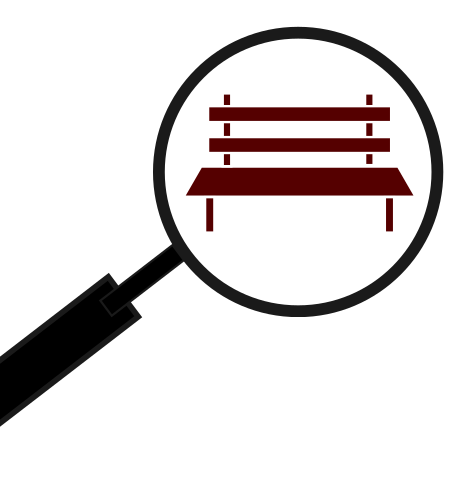
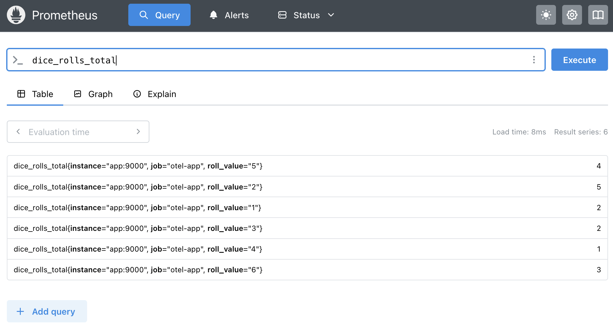
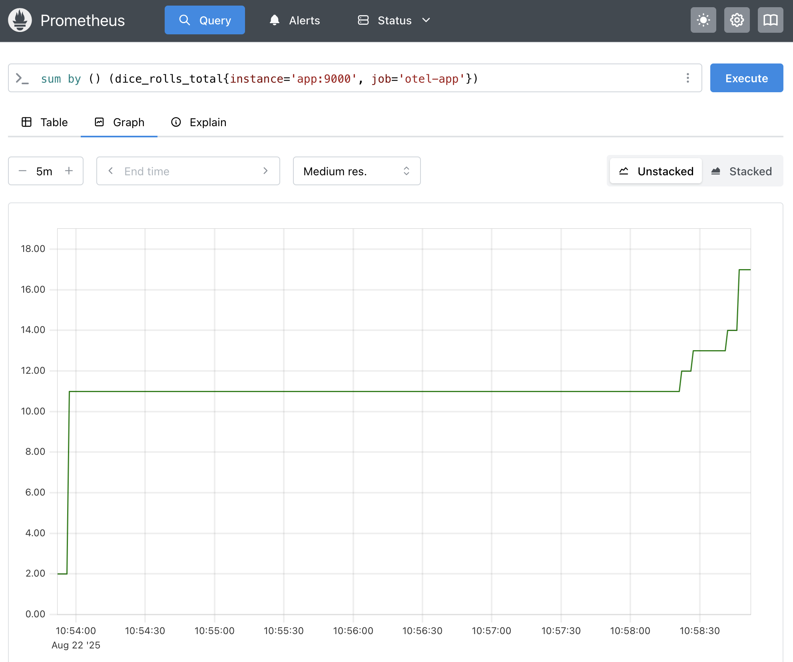
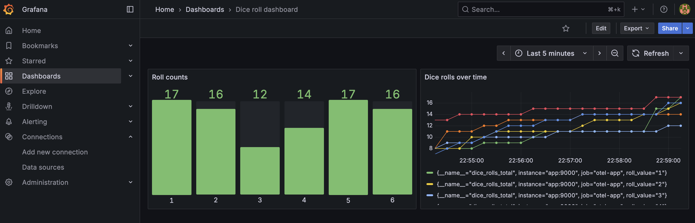

# Observability: A Practical Primer for RSEs
### RSECon25 Walkthrough

Alex Lubbock
Rosalind Franklin Institute

**git clone
[https://github.com
/rosalindfranklininstitute
/rsecon25-observability-primer](https://github.com/rosalindfranklininstitute/rsecon25-observability-primer)**


---

# Learning Objectives

By the end of this walkthrough, you should:

- Understand what **observability** is and why it matters
- Know where observability can and should be applied
- See how to add observability into your own Python code
- Gain hands-on practice with simple use cases

---

# Audience & Scope

- Targeted at **Research Software Engineers (RSEs)** and related roles
- Focus: workloads in **batch/HPC** and **cloud/server** contexts
- We will use **Python**, but the principles generalise
- Introductory level

---

# What is Observability?

**Definition:**
Ability to understand the internal state of software and systems
via event-driven outputs: **logs, metrics, traces**

**Use cases:**

- Troubleshooting failures
- Performance monitoring & capacity planning
- Security & auditing
- Usage analytics

---

# Why Observability?

Observability is most valuable when:

- Systems are **complex** (many ways to fail)
- Workloads are **remote** (HPC, cloud, distributed)
- **High reliability** is required (uptime, reproducibility, security)

➡ Research computing often checks *all three boxes*.

---

# Why Observability in Research?

- **Reproducibility**: ensure results can be tied to exact code, data, and environment
- **Debugging**: batch jobs may fail hours into execution → metadata helps diagnose
- **Performance drift**: explain why the same job took 2 hours last month, 6 hours today
- **Collaboration**: share structured context with teammates, not just “logs.txt”

---

# Workloads We’ll Focus On

- **Batch / HPC jobs**
  (SLURM, Snakemake, Nextflow, Argo Workflows, Airflow)
- **Cloud / long-running services**
  (Web apps, APIs, servers)

Different environments → different tools & strategies

---

# Outputs Used in Observability - Logs

- **Logs** → notable events, warnings, errors
- Usually timestamped
- Examples: system start/stop, exceptions, requests


```
***  DEBUG  | 2025-08-08 10:07:03 | Server started
***  INFO   | 2025-08-08 10:08:37 | Request from user Alice for IMG01.TIF
***  WARN   | 2025-08-08 10:08:37 | Memory usage high
***  ERROR  | 2025-08-08 10:08:38 | Out of memory
```

---

# Outputs Used in Observability - Metrics

- **Metrics** → (numerical) state
(e.g. memory usage, throughput, uptime)

```
requests_per_second{url="/process-image"} 12.2
requests_failed{url="/process-image"} 4.0
```


---

# Outputs Used in Observability - Traces

- **Traces** → sequence of function calls or request paths
(e.g. Python traceback, API calls)

```
Frontend
 ├─ Auth Service      |■■■■ 12ms
 │   └─ Imaging API   |    ■■■■■■■■■■ 30ms
 │       └─ Database  |              ■■■■■■■■■■■■■■■ 45ms
 └─ Metrics Service   |■■■ 9ms
---------------------------------------------------------
 Total span time (sum): 95ms
 Wall clock time (end-to-end): 87ms
```

---

# Observability: A Practical Primer for RSEs
### Metadata Capture for Python Workflows

---

# Motivation

- When running jobs on HPC or batch systems:
  - Do you know how much memory was used?
  - How long did each function take?
  - Which software/library versions were active?
- Traditional logs don’t always capture this metadata
- How can we capture useful metadata
(runtime, memory usage, environment, package versions)
**with minimal effort?**

---

# Why Microbench?

- Lightweight Python package:
  `pip install microbench`
- Decorator-based: instrument functions with **minimal boilerplate**
- Capture (e.g.):
  - Timing
  - Memory usage
  - Environment details (e.g., Python version, Conda env, Git commit)
- Store metadata for later analysis



---

# Clone the Repo to Follow Along

Clone the repo, if you haven't already:

```bash
git clone https://github.com/rosalindfranklininstitute/rsecon25-observability-primer

cd rsecon25-observability-primer
```

---

# Environment Setup

Create a Conda* environment for the demo:

```bash
cd 00-microbench
conda create -n microbench python=3.13 -y
conda activate microbench
pip install -r requirements.txt
```

*Or use venv/poetry/pipenv...

---

# 00-0 Basic Example

```python
from microbench import MicroBench
import time

bench = MicroBench()

@bench
def slow_function(x):
    time.sleep(x)
    return x

slow_function(2)
```

---

# 00-1 Extending with line profiler

```python
from microbench import MicroBench, MBLineProfiler, MBHostInfo, MBPythonVersion

class MyBench(MicroBench, MBLineProfiler, MBHostInfo, MBPythonVersion):
    pass

bench = MyBench()

@bench
def compute(n):
    squares = [i**2 for i in range(n)]
    return sum(squares)

compute(1_000_000)
```

---

# 00-2 Telemetry capture

```python
from microbench import MicroBench

class TelemetryBench(MicroBench):
    telemetry_interval = 1  # sample every 1s

    @staticmethod
    def telemetry(process):
        # For values you can capture from "process", see
        # https://psutil.readthedocs.io/en/latest/#psutil.Process
        return {'cpu_percent': process.cpu_percent()}

bench = TelemetryBench()

@bench
def busy_work():
    ...
```

---

# Where Microbench Helps

- **Dependency mismatches**
    - Confirms which versions of packages were active during execution

- **Performance drift**
    - Detects slower runs, different CPU/memory usage

- **HPC reproducibility**
    - Records environment + metadata for published results

- **Lightweight monitoring**
    - No extra infrastructure, just decorate functions

---

# What Microbench *Doesn't* Do

Microbench captures **metadata and telemetry**, but it is **not** a replacement for:

- **Good reproducibility practices**:
  - Version control & Git history
  - Documentation of workflows
  - CI/CD testing
  - Reproducible environments (Conda, Poetry, virtualenvs)
  - Containers (Docker/Singularity) for portability
- **Full observability stacks** (Prometheus, OpenTelemetry, etc.)
- **Debuggers / profilers** for in-depth code analysis
- **Automated monitoring / alerting** for long-running services

---

# Observability: A Practical Primer for RSEs
### Adding Metrics to a Flask Web App

---

# Intro to OpenTelemetry

- Open-source framework for **instrumenting applications**
- **Standardises formats** for metrics, logs, traces
- Vendor-agnostic: works with Prometheus, Jaeger, etc.
- Language-agnostic: works with most popular languages

---

# Intro to Prometheus

- Open-source **monitoring & alerting** toolkit
- Pull-based metrics collection
- Stores metrics as **time-series data**
- Integrates with dashboards like Grafana

---

# Environment Setup

## Docker Compose (recommended)

```bash
cd 01-prometheus
docker compose up -d
```

## Python

```bash
cd 01-prometheus/app
conda create -n prom python=3.13 -y
conda activate prom
pip install -r requirements.txt
python app.py
```

---

# Motivating Example: Dice Roll App

- Simple Flask web app
- Endpoint: `/` → rolls a dice (1-6)

```python
app = Flask(__name__)

@app.route("/")
def roll_dice():
    # Roll the dice (random number 1-6)
    result = str(roll())

    return result
```

---

# Adding Metrics: Dice Roll Counts (Setup)

- Track **how many times each number is rolled**
- Export metrics on **/metrics** endpoint

```python
# Add prometheus wsgi middleware to route /metrics requests
app.wsgi_app = DispatcherMiddleware(app.wsgi_app, {
    '/metrics': make_wsgi_app()
})

# Create a counter instrument with label "roll_value"
roll_counter = Counter(
    "dice_rolls", "The number of rolls by roll value", ["roll_value"]
)
```

* Other options available if not using Flask, see:
https://prometheus.github.io/client_python/exporting/

---

# Adding Metrics: Dice Roll Counts (Add counter)

```python
@app.route("/")
def roll_dice():
    # Roll the dice (random number 1-6)
    result = str(roll())

    # Count the dice roll against a tally for that value
    roll_counter.labels(roll_value=result).inc()
```

---

# The Web App

- Flask app running locally (Docker or Python env.)
- Open web browser to http://localhost:9000
- `/` endpoint returns dice roll result, e.g.:

```
5
```

- Refresh the web page to generate dice rolls over ~20 seconds
- Or use the `./generate-dice-rolls.sh` script (Linux/Mac/WSL only)

---

# Metrics Export Page

- Prometheus exporter exposes a `/metrics` endpoint
- Open web browser to http://localhost:9000/metrics
- Prometheus scrapes metrics from this page

```
# HELP dice_rolls_total The number of rolls by roll value
# TYPE dice_rolls_total counter
dice_rolls_total{roll_value="4"} 16.0
dice_rolls_total{roll_value="2"} 19.0
dice_rolls_total{roll_value="5"} 21.0
dice_rolls_total{roll_value="3"} 22.0
dice_rolls_total{roll_value="6"} 12.0
dice_rolls_total{roll_value="1"} 16.0
```

---

# Prometheus Metrics for Dice Roll

- (Docker only) View the Prometheus UI at http://localhost:9090
- Metrics are available for each dice number
- Search for `dice_rolls_total`



---

# Aggregated Metrics Over Time

- On the Prometheus **Graph** tab, search for
  `sum by () (dice_rolls_total{instance='app:9000', job='otel-app'})`
- This shows total number of dice rolls over time
- PromQL allows SQL-like querying, aggregation



---

# Grafana dashboards

- (Docker only) View the Grafana UI at http://localhost:3000
- Login in using username `admin`, password `admin`
- (Change password if prompted)



---

# Other Use Cases for Metrics

- Track **HTTP request count & latency**
- Monitor **errors & exceptions**
- Database query metrics
- Custom application events
- https://prometheus.io/docs/concepts/metric_types/

---

# Beyond Metrics: Logs & Traces

- **Logs:** capture detailed runtime events
- **Traces:** visualise request flows across services
- Complements metrics to **fully understand app behavior**

---

# Summary

- Observability
    - Metrics + Logs + Traces
    - Reproducibility, monitoring, troubleshooting, auditing
- Microbench **captures metadata** from batch jobs
- OpenTelemetry **standardises instrumentation**
- Prometheus **collects and visualises metrics**

---

# Useful References

- Microbench: [https://github.com/alubbock/microbench](https://github.com/alubbock/microbench)
- OpenTelemetry Python: [https://opentelemetry.io/docs/python](https://opentelemetry.io/docs/python)
- Prometheus: [https://prometheus.io/docs/introduction/overview/](https://prometheus.io/docs/introduction/overview/)
- Metrics & Monitoring: [https://prometheus.io/docs/practices/instrumentation/](https://prometheus.io/docs/practices/instrumentation/)
- OpenTelemetry + Prometheus Exporter: [https://opentelemetry.io/docs/instrumentation/python/exporters/prometheus/](https://opentelemetry.io/docs/instrumentation/python/exporters/prometheus/)
- Loki (log aggregation): [https://grafana.com/oss/loki/](https://grafana.com/oss/loki/)
- Jaeger (trace aggregation): [https://www.jaegertracing.io/](https://www.jaegertracing.io/)
- Microsoft on Observability: [https://microsoft.github.io/code-with-engineering-playbook/observability/](https://microsoft.github.io/code-with-engineering-playbook/observability/)

---

# Questions?

**BlueSky**: [@AlexLubbock.com](https://bsky.app/profile/alexlubbock.com)

Slides and example code: [https://github.com
/rosalindfranklininstitute
/rsecon25-observability-primer](https://github.com/rosalindfranklininstitute/rsecon25-observability-primer)


